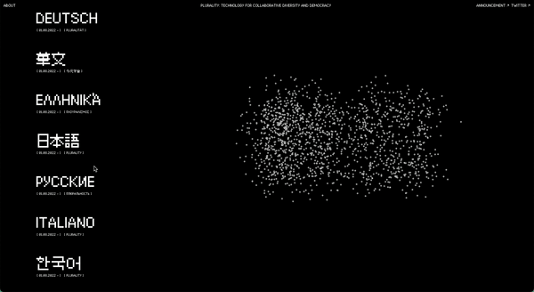

  
  <h1>Welcome to Plurality.net!</h1>

This is an early version of plurality.net, _Plurality: Technology for Collaborative Diversity and Democracy_'s website. The goal of the website is to provide a place for people read the book, and to welcome — and eventually manage — participation in the project.

## Contributing

#### Development

Run `npm ci` to clean install dependencies from `package-lock.json` or run `npm install` to install dependencies from `package.json`, then run `npm run start` to serve the site at `localhost:8080` or `npm run build` to otherwise write `src` files to `dist`.

#### Translations

Translations of the book into other languages are welcome. Please see [the translation guide](./docs/translation.md) for more information.

## Design System

Design decisions that have been made thus far recall that the website aspires to serve as a strong, uncomplicated foundation for diverse participation and reading. These design decisions have therefore tried to optimise for simplicity, clarity, and accessibility.

#### Typography

The website uses two fonts: [Authentic Sans](https://authentic.website/sans), distributed freely under [WTFPL](http://www.wtfpl.net/), and [Lanapixel](https://opengameart.org/content/lanapixel-localization-friendly-pixel-font), distributed under [OFL](./src/site/_data/fonts/lanapixel/LanaPixel_OpenFontLicense.txt). The former is used for body text, and the latter for nav items, headings, and other UI elements.

#### Colors

The color pallete is minimal, using only two colors: `#000000` and `#ffffff`. The former is used for the backgrounds, the latter for the text elements. In the about and translation pages, users are able to toggle between light and dark mode.

#### Layout and Navigation

Each core layout extends `src/site/_includes/layouts/base.njk`:

- The home page (`src/site/_includes/layouts/home.njk`) consists of three components: a top navigation bar that links to the about page and relevant external URLs, an interactive p5.js render of the ideographic characters for digital and plural, 數位, and a menu of all of the different translations of the book.
- The layout for the different translations (`./src/site/_includes/layouts/version.njk`) of the book consists of a top navigation bar that allows users to return to the home page and switch between light and dark mode, and a main content area that contains both the book's content and its navigational table of contents.
- The layout for the about page (`src/site/_includes/layouts/about.njk`) consists of a top navigation bar that allows users to return to the home page and switch between light and dark mode, and a main content area that contains the about page's content.

#### Interactive Characters

The home page features two interactive characters: the ideographic characters for digital and plural, 數位, rendered using p5.js. The characters are composed of circles that, on load, are scarcely distributed across the canvas. They are then animated to move towards their final positions, where they are distributed in a grid-like pattern, as the user scrolls down the page. The characters are rendered using the [p5.js library](https://p5js.org/), and the code for the characters can be found in `src/site/_includes/js/interacitive-characters.js`.

## Codebase

#### Stack

The site is built on Eleventy/11ty, and primarily uses Nunjucks for templating. JavaScript (libraries: p5.js) is used to render interactive elements, and vanilla CSS is used for styling.

#### Structure

The structure of the codebase is heavily influenced by that of the RadicalxChange Foundation's website ([repo](https://github.com/RadicalxChange/www])), as it exists in 10/2022. Important facets of the codebase's structure are described below:

- `src/site` contains the source code for the site, which is written into the 'dist' folder.
- `src/site/_includes` contains reusable components, and is divided into the following sub-folders: 'js', 'macros', 'css', 'layouts', and 'partials'.
  - `src/site/_includes/macros` contains reusable Nunjucks macros, and `src/site/_includes/js` contains reusable JavaScript code. These are used to compose layouts (`src/site/_includes/layouts`) and partials (`src/site/_includes/partials`), and therefore serve as site's building blocks.
  - `src/site/_includes/css` contains CSS code, split into .css files that correspond roughly to the different layouts of the site. The CSS is compiled into a single 'main.css' file, where root variables are defined and which is then minified and written into the 'dist' folder.
- `src/site/_data` contains sub-folders, each mapping to a data type, whose contents are used to populate the site's content.
- `src/site/_versions` consists of markdown files, each mapping to a translation of the book. The data in these markdown files is used to write to the 'dist' folder, dynamially generating different `dist/v/...` folders.
